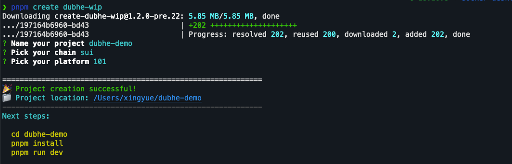
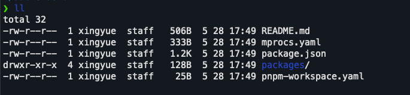
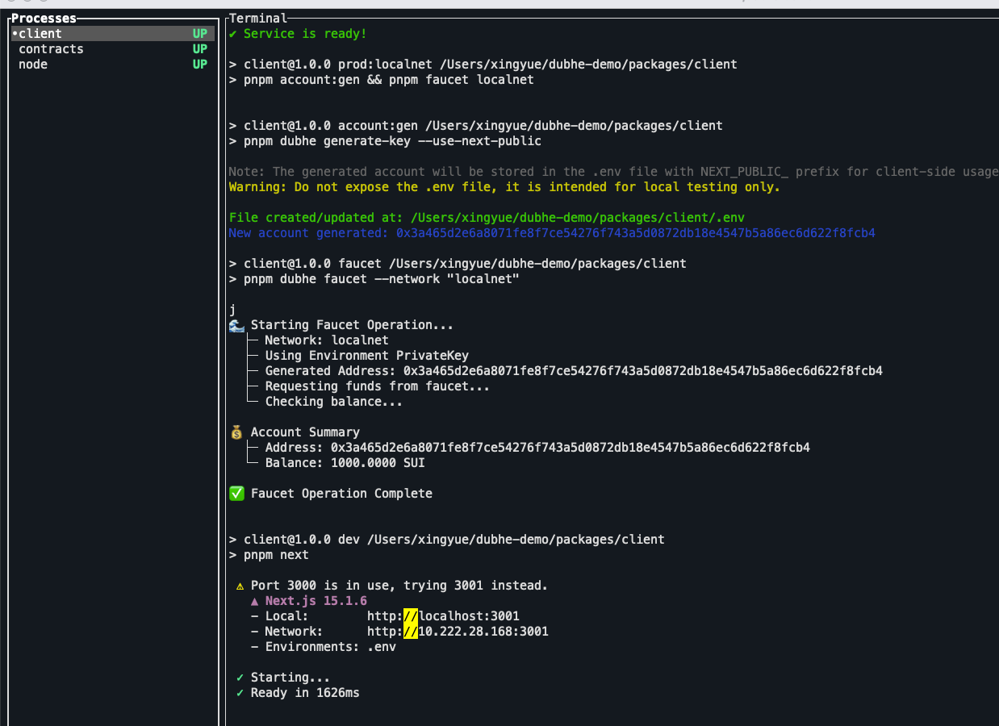
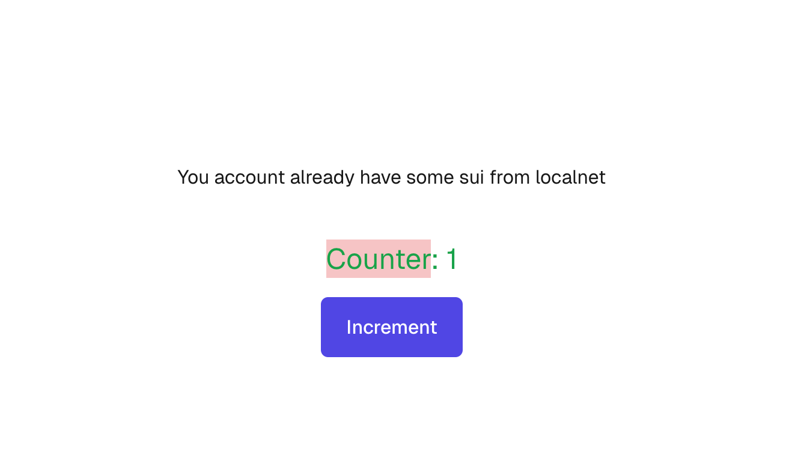
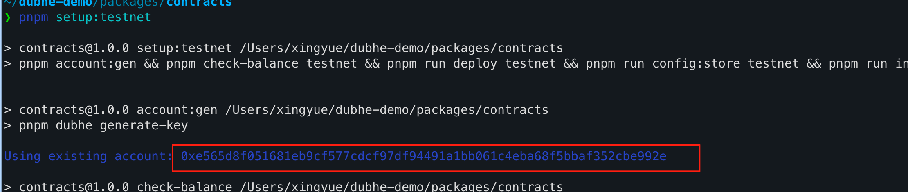
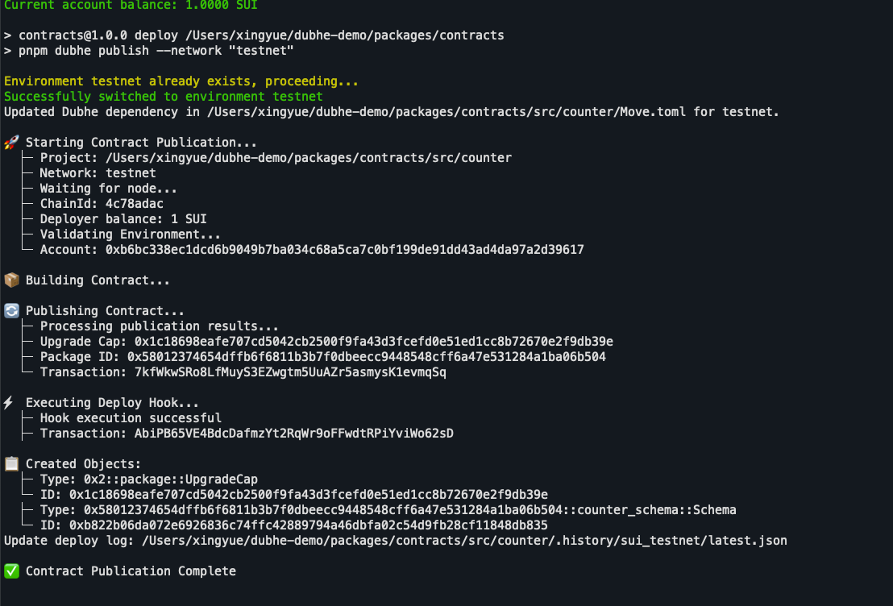

## 配置 `sui` 的 cli 环境

使用 [suiup](https://github.com/MystenLabs/suiup) 配置开发环境

### From Script

```shell
curl -sSfL https://raw.githubusercontent.com/Mystenlabs/suiup/main/install.sh | sh
```

### From Cargo

```shell
cargo install --git https://github.com/Mystenlabs/suiup.git --locked
```

### 安装需要的 `sui`

```shell
suiup install sui
suiup install sui@1.44.2 # 安装指定版本
suiup install sui@devnet # 安装指定的 release
```

### 安装 `walrus` (可选)

```shell
suiup install walrus -y
```

## 配置 `Dubhe`

### 安装 `nodejs`

推荐使用 `nvm`

```shell
curl -o- https://raw.githubusercontent.com/nvm-sh/nvm/v0.40.1/install.sh | bash
nvm install v18.20.8 # 推荐使用 18 的版本，和 开发者环境对齐 😄
```

## 新建脚手架

### create

```shell
pnpm create dubhe-wip
```

按照如下的选项，选择 sui 101 的项目作为入门示例。



### 文件说明

创建出来的项目是一个 多 package 的 workspace 项目，文件列表如下



- package.json 为项目的主配置文件

script 部分包装了常用的工具。
其中 `pnpm run dev` 会启动一个 mprocs 管理程序。

- mprocs.yaml

这里配置了 mprocs 启动的进程列表，你也可以按照自己的实际清况，添加修改

- packages

  这里有两个 package : _client_ 和 _contracts_

  - client 是一个运行的 web 客户端，用来调试合约调用的 dapp 程序 ， 也是一个 next.js 程序
  - contracts 这里包含了合约部分。这里包含了合约的常用操作 script 也是 `dubhe`的核心项目。这里包含一个 默认的 indexer 程序，client 会从这里获取数据。

### 安装 启动 dev

```shell
pnpm install
pnpm run dev
```



启动以后，dubhe 帮我们做的事情如下：

1. 启动一个本地节点在 127.0.0.1:9000 及 faucet 接口: http://127.0.0.1:9123/
2. 产生若干个 faucet 好 SUI 的帐号
3. 部署 contracts 部分的合约到本地节点
4. 启动一个 sqlite indexer
5. 启动一个 对应的 dapp 程序

其中， 1 和 2 在 node 的进程中 , 3 和 4 在 contracts 的进程中 ， 5 在 client 的进程中。

## 测试本地运行

按照 dev 的方式启动以后，用浏览器打开 dapp 站点: http://localhost:3000 。
你将可以看到如下的一个 counter 的 dapp.



这个 dapp 不需要连接 wallet ，使用的 client/.env 中 声明的 私钥直接进行签名交互。

## 发布到 testnet

在 contracts 目录执行 `pnpm setup:testnet` 即可完成发布。



注意: testnet 的 faucet 不能用，所以，需要提前准备好 testnet 的 Sui 作为 发布 gas。
testnet 水龙头: https://faucet.sui.io/

准备好 gas 后，再次发布,就可以看到发布的结果



这里，你可以看到你的发布信息

- 发布的交易
- 发布的 package id
- 更新的 Upgrade Cap
- 在 dubhe 注册交易

部署信息在 ./deployment.ts
这里可以看到完整的 history 信息： src/counter/.history/sui_testnet/latest.json

## 相关链接

- [mprocs](https://github.com/pvolok/mprocs)
- [suiup](https://github.com/MystenLabs/suiup)
- [nvm](https://github.com/nvm-sh/nvm)
